<!-- DSF2026 用のスライドはこのファイルを正とする。セミナー後に必要な箇所を各章のスライドへ反映する -->

<style>
img[alt~="center"] {
  display: block;
  margin: 0 auto;
}
.ss {
  border: 2px dashed #c05621;
  color: #c05621;
  padding: 8px 16px;
  font-size: 70%;
}
</style>

<!-- _paginate: false -->

# 低価格FPGAボードで体験するFPGA開発

CQ出版＆DSF コラボ企画　DSF2026 ハンズオン（2026年10月6日）

<div style="text-align:right">
井田 健太（Nature株式会社）<br>
鈴木 量三朗（有限会社シンビー）
</div>

<div style="font-size:70%"><a href="https://github.com/Lathe-Mariel/DSF2026_FPGA_seminar">https://github.com/Lathe-Mariel/DSF2026_FPGA_seminar</a></div>
<div style="font-size:60%; color:#52606d">CC BY 4.0 ／ 元の教材: 井田 健太，望月 英輔，鈴木 量三朗（CQ出版 FPGA セミナー教材）</div>

---

<style scoped>section { font-size: 24px; } td:first-child { white-space: nowrap; }</style>

## 本日の内容

| | 内容 | 進め方 |
|---|---|---|
| 1-1 | FPGA の仕組み | 講義 |
| 1-2 | FPGA ボード Tang Nano 9K | 講義 |
| 2-1 | Gowin EDA の使い方: L チカ | ハンズオン |
| 2-2 | 静的タイミング解析（STA） | 講義・ハンズオン |
| 2-3 | スイッチ入力 | ハンズオン |
| 2-4 | ストップウォッチ | ハンズオン |
| 3-1 | シミュレーションとテストベンチ | デモ |
| 3-2 | GAO | 紹介 |

---

## 準備

- PC に Gowin EDA **V1.9.11.03 Education** をインストールしておく
- 使うもの: Tang Nano 9K，USB ケーブル
- 資料とプロジェクトファイルは GitHub のリポジトリにある
  - https://github.com/Lathe-Mariel/DSF2026_FPGA_seminar
  - スライド中のパスは，リポジトリの先頭からの相対パス

---

<style scoped>section { font-size: 24px; }</style>

## リポジトリを手元に持ってくる

- **git を使う場合**: コマンドラインシェルで次を実行する

```
> git clone https://github.com/Lathe-Mariel/DSF2026_FPGA_seminar.git
```

- **zip でダウンロードする場合**
  1. ブラウザで https://github.com/Lathe-Mariel/DSF2026_FPGA_seminar を開く
  2. 緑色の **Code** ボタンを押し，**Download ZIP** を選ぶ
  3. ダウンロードした zip を展開する。フォルダ名は `DSF2026_FPGA_seminar-main` になる
- 展開したフォルダの `project` の下に，各プロジェクトがある
- Gowin EDA でプロジェクトを開くときは，各フォルダの `.gprj` ファイルを選ぶ

---

# 1-1. FPGA の仕組み

---

<style scoped>section { font-size: 26px; }</style>

## FPGA とは

- **F**ield **P**rogrammable **G**ate **A**rray
  - 買ったあとに中の**論理回路を何度でも書き換えられる** IC
- 似たものとの違い

| | 書き換えられるもの | 特徴 |
|---|---|---|
| マイコン | ソフトウェア | 回路は固定。命令を順番に実行する |
| **FPGA** | **回路そのもの** | 必要な回路をその場で作れる |
| ASIC | 書き換えられない | 量産すれば 1 個あたりは速く安いが，作るのに大きな費用と時間がかかる |

---

## CPU と FPGA の違い

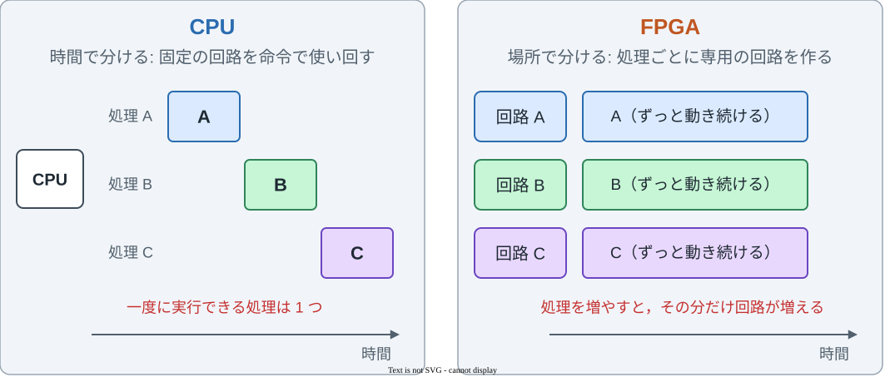

- CPU（単一コア）は，1 つの回路を時間で区切って使い回す
- FPGA は，処理ごとに回路を並べる。書いた回路はすべて**同時に**動く

---

<style scoped>section { font-size: 25px; }</style>

## FPGA の使われるところ

- 主な分野
  - 通信機器: 基地局，ネットワーク装置
  - 画像・映像処理: カメラ，ディスプレイ
  - 計測・制御機器
  - ASIC を作る前の試作
- FPGA が選ばれる理由
  - **リアルタイム性を保証しやすい**: 処理ごとに専用の回路を用意できる。CPU のように 1 つの回路を時分割で使い回さないので，ほかの処理に待たされない
  - **入出力を自由に作れる**: 独自の通信方式やタイミングの信号を，回路として作れる
- 向かない処理
  - 複雑な手順の処理，あとから頻繁に変える処理 → CPU が向く
  - 大量の演算が必要で，レイテンシが重要でない処理 → GPU が向く。演算回路の規模では GPU にかなわない

---

## FPGA の中身

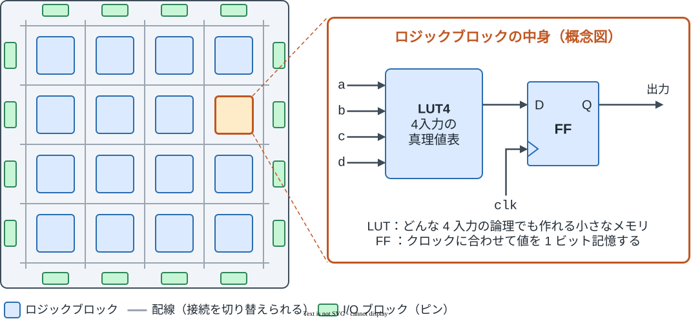

- LUT と FF を組にしたロジックブロックをたくさん並べ，配線のつなぎ方を切り替えて回路を作る

---

<style scoped>section { font-size: 24px; }</style>

## LUT: 真理値表で論理回路を作る

- LUT（Look Up Table）は，入力の組み合わせごとに出力を覚えておく小さなメモリ
- 例: 2 入力の AND を LUT で作る

| a | b | LUT に覚えさせる出力 |
|:-:|:-:|:-:|
| 0 | 0 | 0 |
| 0 | 1 | 0 |
| 1 | 0 | 0 |
| 1 | 1 | 1 |

- 覚えさせる値を変えれば OR にも XOR にもなる
- LUT4 は 4 入力の LUT。16 通りの出力を覚えて，どんな 4 入力の論理でも作れる

---

## FPGA の開発方法と今日やる範囲

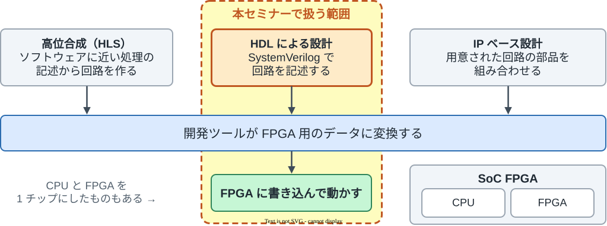

- **今日やること**: 回路を記述する言語 **SystemVerilog** で小さな回路を書き，FPGA で動かす
- **今日やらないこと**: HLS，IP ベース設計，SoC FPGA

---

# 1-2. FPGA ボード Tang Nano 9K

---

## Tang Nano 9K ボードの構成

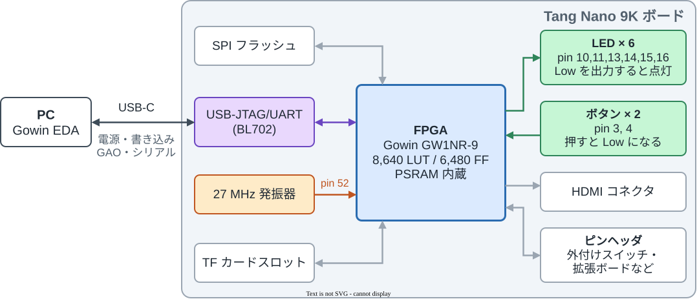

- Sipeed 社の FPGA ボード。Gowin 社の FPGA **GW1NR-9** を搭載している

---

## LED とボタンは Low で動く

| 部品 | ピン | 動き |
|---|---|---|
| LED × 6 | 10, 11, 13, 14, 15, 16 | FPGA が **Low** を出すと**点灯** |
| ボタン S2 | 3 | **押すと Low**，離すと High |
| ボタン S1 | 4 | **押すと Low**，離すと High |

- このように Low で有効になる信号を**負論理**という
- このあとのコードでは，`~` で反転して扱いやすくしている

---

## クロックは 27 MHz

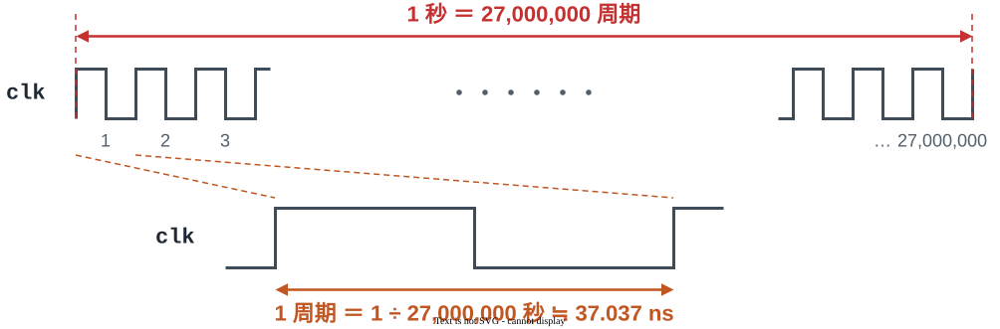

- ボード上の発振器から，FPGA の 52 番ピンに 27 MHz のクロックが入る
- クロックを 27,000,000 回数えると 1 秒。L チカやストップウォッチは，この考え方で時間を作る

---

<style scoped>section { font-size: 26px; }</style>

## 搭載している FPGA: GW1NR-9

- Gowin Semiconductor 社の小規模な FPGA
- 型番は **GW1NR-LV9QN88PC6/I5**。Gowin EDA でデバイスを選ぶときに使う
- 回路のデータを保存するフラッシュメモリを内蔵している。外付けのメモリなしで動く

| 資源 | 数 | 用途 |
|---|---|---|
| LUT4 | 8,640 個 | 論理回路を作る。CFU 1,080 個分 |
| FF | 6,480 個 | 値を記憶する |
| BSRAM | 468 Kbit | FPGA 内のメモリ。GAO が波形の記録に使う |
| PLL | 2 個 | クロックの周波数を変える。今日は使わない |
| PSRAM | 64 Mbit | 大容量のメモリ。今日は使わない |

---

## GW1NR のロジックブロック: CFU

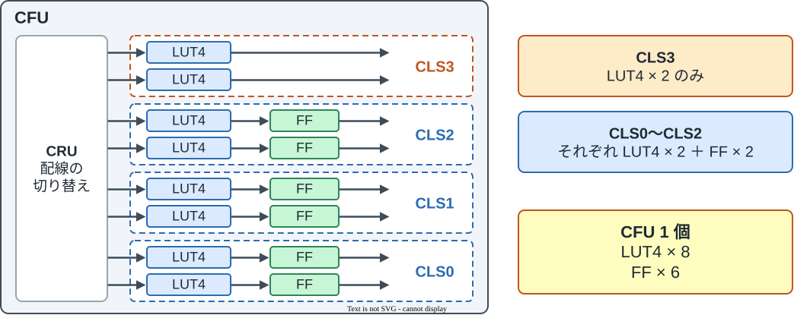

- GW1NR では，ロジックブロックを **CFU**（Configurable Function Unit）と呼ぶ
- CFU は 4 つの CLS と，配線を切り替える CRU でできている
- LUT4 は論理回路のほかに，加算器やカウンタ，小さなメモリとしても使える

---

# 2-1. Gowin EDA の使い方: L チカ

---

## Gowin EDA

- Gowin 社製 FPGA の統合開発環境。Windows 用と Linux 用がある
- 本セミナーでは **Education 版**を使う
  - ライセンス申請不要で無償
  - 非商用・非製品の開発のみ
  - 小規模な FPGA だけに対応。GW1NR-9 は対応している
- 通常版はライセンス申請が必要で，商用利用可能・全デバイス対応
- 本セミナーの基準バージョン: **V1.9.11.03 Education**

<small>Windows 用と Linux 用は見た目と操作感は同じだが，JTAG 関連の動作に若干の違いがある</small>

---

## 開発フロー

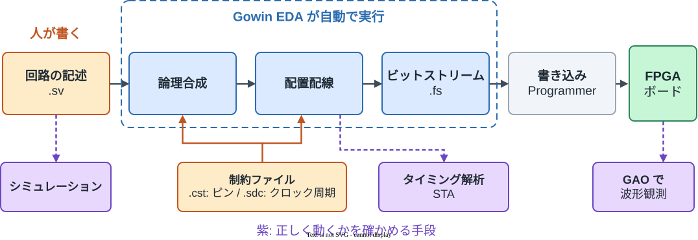

---

## 開発フローで使うファイル

| ファイル | 中身 | 作るのは |
|---|---|---|
| `.sv` | SystemVerilog で書いた回路 | 開発者 |
| `.cst` | どの信号を何番ピンにつなぐか | 開発者 |
| `.sdc` | クロックの周期などのタイミング制約 | 開発者 |
| `.fs` | ビットストリーム | Gowin EDA |

- このあと L チカで，実際にこれらのファイルを作る

---

<style scoped>section { font-size: 25px; }</style>

## SystemVerilog とは

- 回路を記述するための言語。ハードウェア記述言語（HDL）の 1 つ

```sv
module example (                 // module: 回路のひとまとまり
  input  wire  clk, a, b,        // input:  外から入ってくる信号
  output logic y                 // output: 外へ出ていく信号
);
  logic and_ab;                  // logic:  回路の中の信号

  always_comb begin              // 組み合わせ回路: a と b の AND
    and_ab = a & b;
  end

  always_ff @ (posedge clk) begin   // FF: クロックの立ち上がりで値を記憶する
    y <= and_ab;
  end
endmodule
```

- プログラムと違い，上から順に実行されるのではない。書いた回路はすべて同時に動く

---

## デザイン作成1：新規プロジェクトの作成

- Gowin EDA を起動したら、「New Project」アイコンをクリック
- ポップアップされた画面で「FPGA Design Project」を選択し、OK をクリック

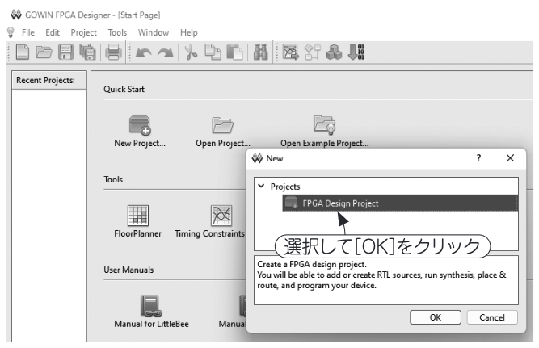

---

## デザイン作成2：プロジェクト名の設定

- Project Wizard が起動する
- プロジェクト名と保存場所を指定してNext をクリック

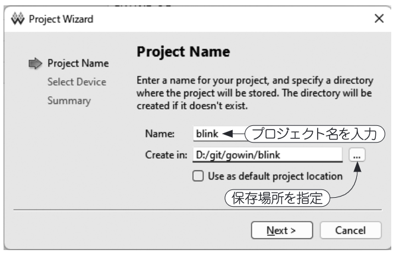

---

## デザイン作成3：使用するFPGA の選択

- Select Device の画面で使用するデバイスを選択する
  - Tang Nano 9K には「GW1NR-9」が搭載されている
- Series で「GW1NR」を選択するとデバイスが現れるので、選択しNext をクリック

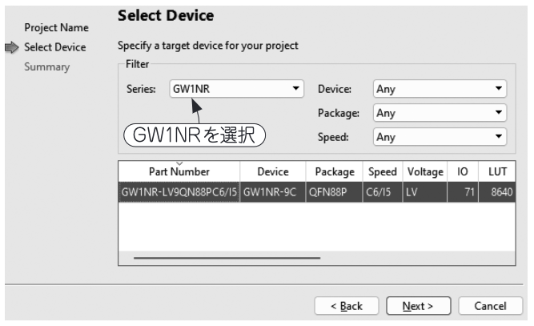

---

## デザイン作成4：プロジェクトサマリの確認

- プロジェクトのサマリが表示される
- 問題なければFinish をクリックして完了

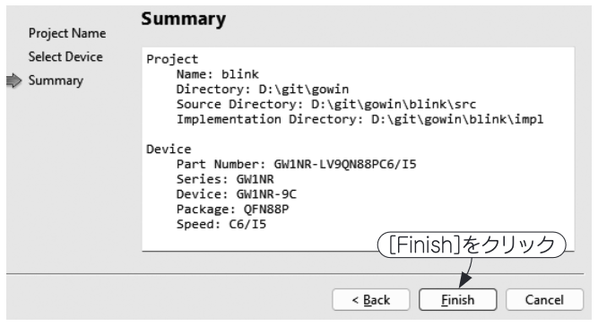

---

## デザイン作成5：デザイン・ファイルの追加

- プロジェクトの作成が完了していれば以下のような画面になっているはず
- ツール・バーの左端のアイコンをクリックし、デザイン・ファイルを追加していく

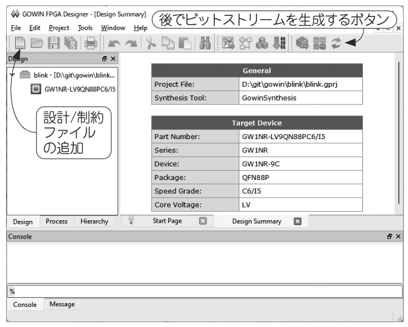

---

## デザイン作成6：SystemVerilog ファイルの追加 - 1

- ポップアップされたウインドウで、FPGAの実装に必要なファイルを追加していく
- Verilog File を選択してからOK をクリック

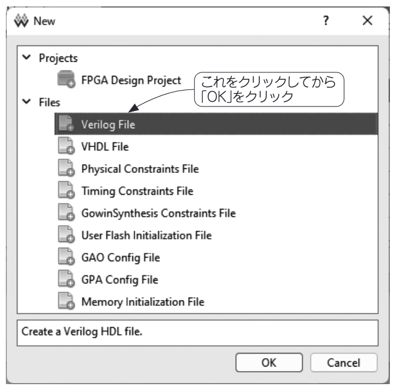

---

## デザイン作成7：SystemVerilog ファイルの追加 - 2

- ポップアップされた画面で以下を指定
  - ファイル名: top
  - 拡張子: .sv
  - 保存場所: 任意の場所

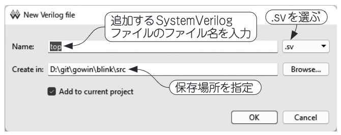

---

## デザイン作成8：SystemVerilog ファイルの編集

- テキスト・エディタが自動的に開くので、以下を記述。`top` というモジュールを記述したことを覚えておく

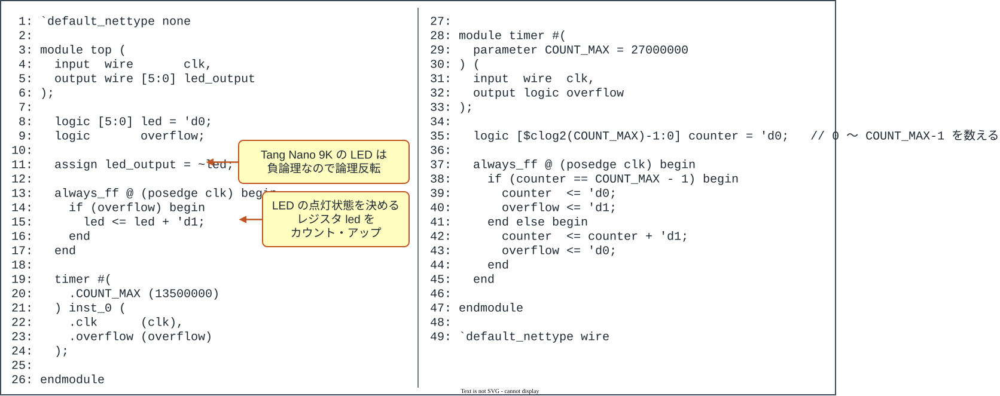

- 同じコードが [`project/blink/src/top.sv`](https://github.com/Lathe-Mariel/DSF2026_FPGA_seminar/blob/main/project/blink/src/top.sv) にある。内容はあとで説明する

---

## デザイン作成9：デザインの最上位モジュールを設定 - 1

- 記述した`top` モジュールをFPGA デザインの最上位モジュールとして設定する
- 「Project」-「Configuration」をクリック

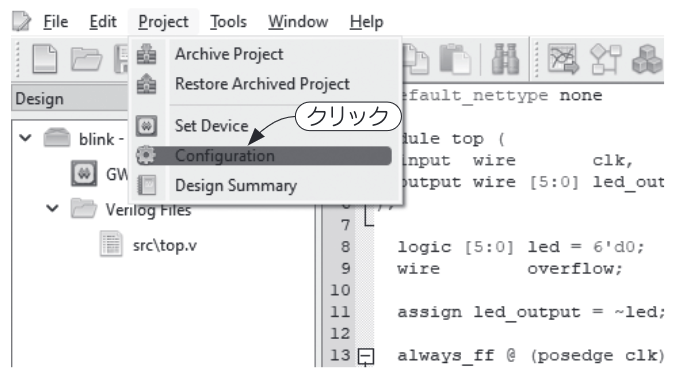

---

## デザイン作成10：デザインの最上位モジュールを設定 - 2

- ポップアップされた画面で「Synthesis」を選択し、下記を設定
  - Top Module/Entity: top
  - Verilog Language: System Verilog 2017

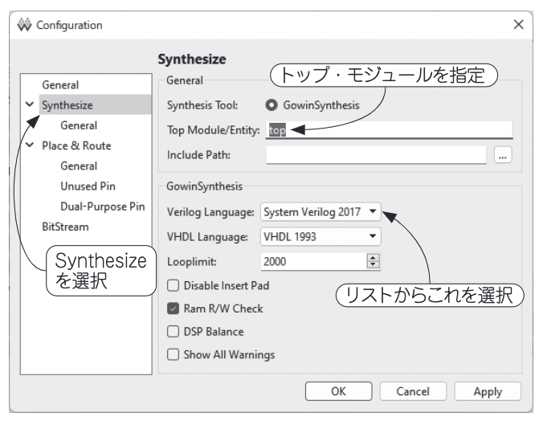

---

## デザイン作成11：タイミング制約の設定

- デザイン・ファイル追加時と同様に、ツール・バーの左端のアイコンをクリック
- 「Timing Constraints File」を選択してOK をクリック
- ファイル名を`top.sdc` とし、下記を記述する

```
create_clock -name clk -period 37.037 -waveform {0 18.518} [get_ports {clk}] -add
```

- 記述した内容は下記の通り
  - clk という名のポートをクロックとして扱う
  - クロック周期は37.037 ns
    - 周波数に換算すると27 MHz
  - クロックの0 ns で立ち上がり、18.518 ns で立ち下がる
    - デューティー50 %

---

## デザイン作成12：ピンアサインの設定

- デザイン・ファイル追加時と同様に、ツール・バーの左端のアイコンをクリック
- 「Physical Constraints File」を選択してOK をクリック

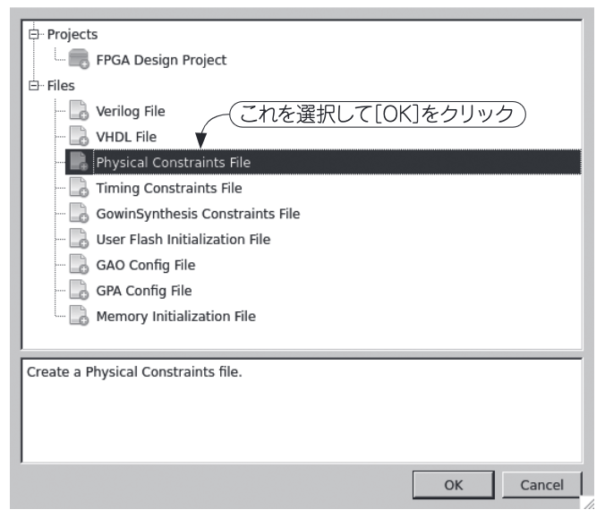

---

<style scoped>section { font-size: 22px; }</style>

## デザイン作成13：物理制約ファイルの編集

- ファイル名を`top.cst` とし、下記を記述する

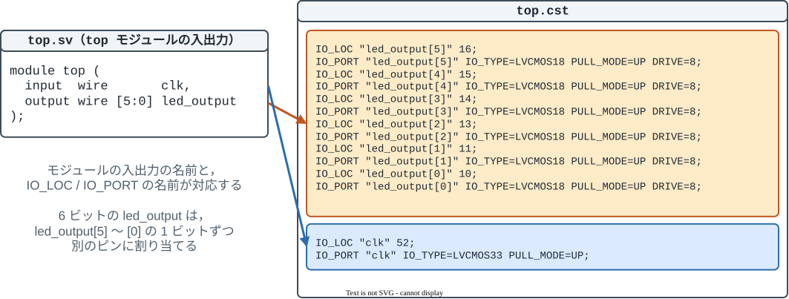

- 記述した内容は下記の通り
  - IO_LOC: top モジュールの各入出力をFPGA のどの番号のピンに接続するか
  - IO_PORT: 各入出力の設定。LED をつないだピンの電源は 1.8 V なので，`IO_TYPE` は `LVCMOS18` にする
- 同じ内容が [`project/blink/src/top.cst`](https://github.com/Lathe-Mariel/DSF2026_FPGA_seminar/blob/main/project/blink/src/top.cst) にある

---

## デザイン作成14：ビットストリームの生成

- ツール・バーの右端のアイコンをクリックすると、ビットストリーム生成が実行


- 正常に終了すると、以下にビットストリームが生成される

```
<プロジェクト・ディレクトリ>/impl/pnr/<プロジェクト名>.fs
```

---

<style scoped>section { font-size: 26px; }</style>

## 回路の書き込み

- FPGA に書き込むデータを**ビットストリーム**という
  - 各 LUT に覚えさせる値と，配線のつなぎ方が入っている
- ビットストリームを書き込んで，FPGA の中に回路を作ることを**コンフィグレーション**という
  - 動作を指す: 「FPGA をコンフィグレーションする」
  - 書き込まれた設定の内容も指す: 「電源を切るとコンフィグレーションが消える」
- GW1NR-LV9 の場合は，フラッシュメモリを内蔵しているので，書き込み先が 2 種類ある
  - **SRAM**: すぐに書き込めるが，電源を切ると消える。今日はこちらを使う
  - **内蔵フラッシュ**: 電源を入れ直しても残る。電源を入れると，ここから自動でコンフィグレーションされる

---

## 実機操作1：Programmer を開く

- Tang Nano 9K と PC を USB ケーブルで接続し、Gowin Programmer を開く

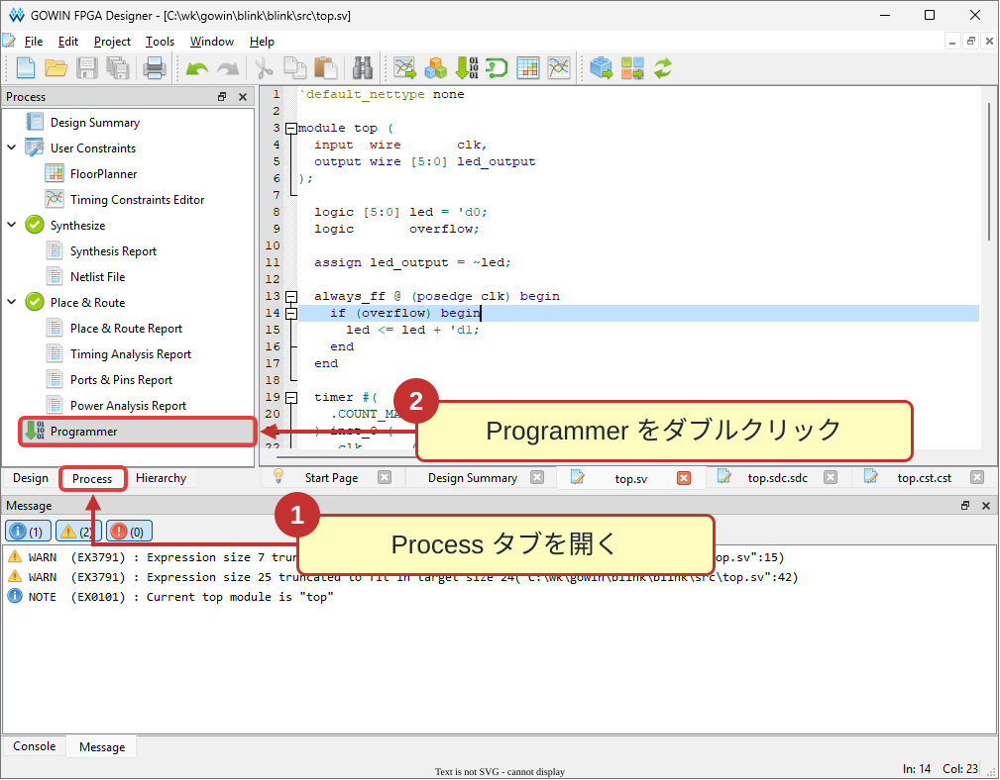

---

## 実機操作2：ケーブルを設定する

- ケーブルの設定画面が出る。ビットストリームは自動で読み込まれている
- Operation が違う場合は、ダブルクリックして SRAM Mode の SRAM Program を選ぶ

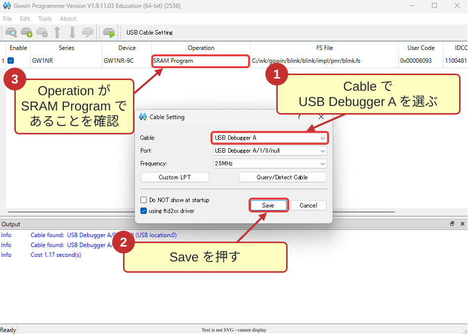

---

## 実機操作3：コンフィグレーションする

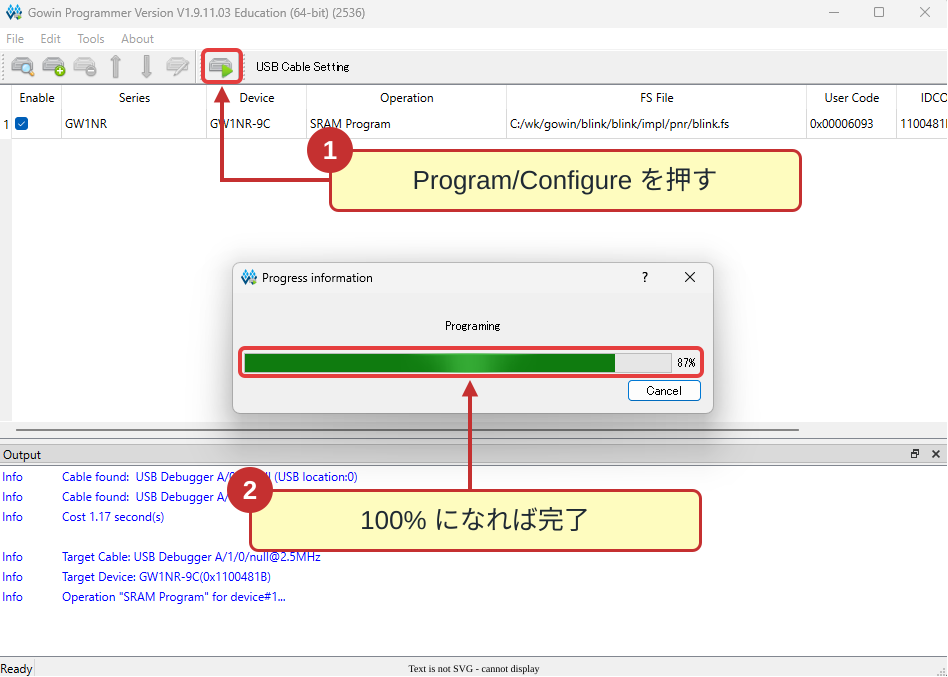

---

## 実機操作4：FPGA の動作確認

- Tang Nano 9K 上のLED が0.5 秒間隔でカウントアップしているはず

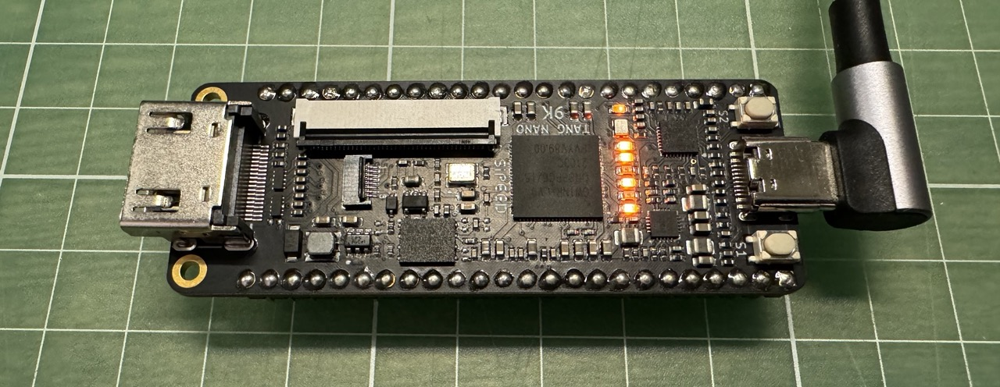

---

<style scoped>section { font-size: 24px; }</style>

## 補足：openFPGALoader でコンフィグレーションする (1)

- openFPGALoader は、オープンソースの FPGA 書き込みツール。コマンドラインで使う
- Windows では、ビルド済みのファイルを取得する。インストールは展開するだけ
  1. https://github.com/ciniml/debug-tools-builder/releases を開く
  2. v1.3 の `openFPGALoader-win.zip` をダウンロードして、好きな場所に展開する
  3. コマンドラインシェルで、展開した `openFPGALoader\bin` フォルダに移動する

```
> cd openFPGALoader\bin
> openFPGALoader.exe --detect
```

- Ubuntu / Debian では `sudo apt install openfpgaloader`、macOS では `brew install openfpgaloader`

---

<style scoped>section { font-size: 24px; }</style>

## 補足：openFPGALoader でコンフィグレーションする (2)

- Windows では、USB ドライバを入れ替える必要がある。Zadig というツールを使う
  1. https://zadig.akeo.ie/ の Download から `zadig-2.x.exe` をダウンロードする
  2. ボードを PC に接続してから、exe を実行する。Zadig のインストールは不要
  3. Options の List All Devices にチェックを入れる

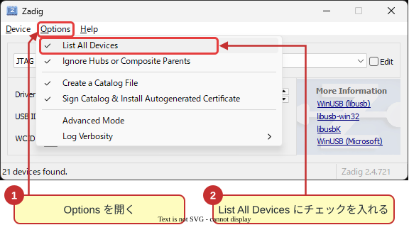

---

## 補足：openFPGALoader でコンフィグレーションする (3)

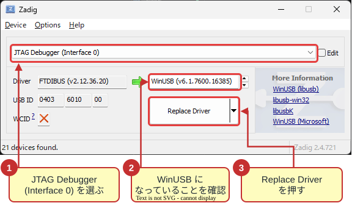

- このドライバは、3-2 の GAO でも使う
- 元に戻すには、デバイスマネージャーで JTAG Debugger のドライバを削除して、ボードを接続し直す

---

<style scoped>section { font-size: 24px; }</style>

## 補足：openFPGALoader でコンフィグレーションする (4)

- ボードが認識されるか確認する。`model GW1N(R)-9C` と表示されればよい

```
> openFPGALoader.exe --detect
```

- ビットストリームを SRAM に書き込む

```
> openFPGALoader.exe <プロジェクト名>.fs
```

- 以下のようなログが表示されれば、書き込み成功

```
Jtag frequency : requested 6.00MHz   -> real 6.00MHz  
Parse file Parse matrix-led.fs: 
Done
DONE
Jtag frequency : requested 2.50MHz   -> real 2.00MHz  
erase SRAM Done
Flash SRAM: [==================================================] 100.00%
Done
SRAM Flash: Success
```

---

<style scoped>section { font-size: 22px; }</style>

## L チカのコードを読む (1): 全体の構成

```sv
module top (
  input  wire       clk,          // 27 MHz のクロック入力
  output wire [5:0] led_output    // LED 6 個への出力
);
  logic [5:0] led = 'd0;          // 6 ビットのカウンタ。初期値は 0
  logic       overflow;           // 約 0.5 秒ごとに 1 クロックだけ 1 になる信号
  // … led を数える回路（次の次のページ）…
  timer #(
    .COUNT_MAX (13500000)
  ) inst_0 (
    .clk      (clk),
    .overflow (overflow)
  );
endmodule
```

- `module` は回路のひとまとまり。`input` と `output` で外とつながる
- `[5:0]` は 6 ビット幅の信号
- `top` の中で，`timer` という別の `module` を部品として使っている

---

<style scoped>section { font-size: 20px; }</style>

## L チカのコードを読む (2): timer

```sv
module timer #(
  parameter COUNT_MAX = 27000000
) (
  input  wire  clk,
  output logic overflow
);
  logic [$clog2(COUNT_MAX)-1:0] counter = 'd0;   // 0 〜 COUNT_MAX-1 を数える

  always_ff @ (posedge clk) begin
    if (counter == COUNT_MAX - 1) begin
      counter  <= 'd0;
      overflow <= 'd1;
    end else begin
      counter  <= counter + 'd1;
      overflow <= 'd0;
    end
  end
endmodule
```

- `counter` をクロックごとに 1 増やし，`COUNT_MAX - 1` になったら 0 に戻して `overflow` を 1 にする
  - `counter` は 0 から `COUNT_MAX - 1` までの `COUNT_MAX` 通りの値をとるので，`overflow` の周期は **`COUNT_MAX`** クロック
- `top` は `COUNT_MAX` に 13,500,000 を指定している。27 MHz ではちょうど 0.5 秒
- `$clog2` は必要なビット数を計算する。ここでは 24 ビット。次のページで説明する

---

<style scoped>section { font-size: 24px; }</style>

## $clog2 でビット数が決まる理由

- n ビットの信号で表せる値は 0 から 2ⁿ − 1 まで。2ⁿ 通り
  - 例: 3 ビットなら 0 から 7 までの 8 通り
- `counter` は 0 から `COUNT_MAX` − 1 までの `COUNT_MAX` 通りの値をとる
  - 2ⁿ ≧ `COUNT_MAX` となる最小の n が、必要なビット数
- `$clog2(x)` は、2ⁿ ≧ x となる最小の n を返す。log₂ x の小数点以下を切り上げた値
  - `$clog2(COUNT_MAX)` で、必要なビット数になる
- 例: `COUNT_MAX` ＝ 13,500,000 のとき
  - 2²³ ＝ 8,388,608 では足りず、2²⁴ ＝ 16,777,216 で足りるので **24 ビット**
- `[$clog2(COUNT_MAX)-1:0]` と書くと、`COUNT_MAX` を変えてもビット幅が自動で合う
- 0 から `COUNT_MAX` までを数えるなら、`COUNT_MAX` ＋ 1 通りなので `$clog2(COUNT_MAX + 1)` にする

---

## L チカのコードを読む (3): always_ff と assign

```sv
assign led_output = ~led;         // led を反転して、常に led_output へ出す

always_ff @ (posedge clk) begin   // クロックの立ち上がりで値を更新する
  if (overflow) begin
    led <= led + 'd1;
  end
end
```

- `assign`: 右辺の値を、左辺の信号に常に出し続ける。FF を使わない**組み合わせ回路**になる
  - LED は Low で点灯するので、`~` で反転して出力している
- `always_ff`: FF を使う回路。**順序回路**になる
- 組み合わせ回路は `always_comb` でも書ける。次のページで比べる

---

## 組み合わせ回路の 2 つの書き方

```sv
output wire  [5:0] led_output     // assign で書くとき: wire で宣言する
assign led_output = ~led;
```

```sv
output logic [5:0] led_output     // always_comb で書くとき: logic で宣言する
always_comb begin
  led_output = ~led;
end
```

- どちらも同じ回路になる
- `always_comb` の中には、複数の行や `if`、`case` を書ける
- `always_comb` や `always_ff` の中で代入する信号は、`wire` ではなく `logic` で宣言する

---

## always_comb の特徴: 上書きができる

L チカの別の書き方の例

```sv
always_comb begin
  led = ~{6{counter[24]}};                              // ① 全LED 点滅
  led = ~{6{counter[24] & counter[23] & counter[22]}};  // ② 全LED 閃光
  led[2:0] = ~{3{counter[24]}};                         // ③ 下3個だけ点滅
end
```

- ①を②で上書き → 全6個が閃光になる
- ③で下3ビットだけ再上書き → 下3個は点滅に戻る

結果: **上3個は短い閃光、下3個はゆっくり点滅**

---

## コードを見てみよう: カウンタ部分

```sv
logic [24:0] counter = '0;

always_ff @(posedge clk)
  counter <= counter + 1'd1;
```

- 25ビットのフリーランニングカウンタ
- 27MHz で 2^25 ≈ 3,355万クロック ≈ 1.24秒で一周

L チカの `timer` モジュールと同じ役割だが、
ここでは **カウンタのビットを直接見る** ことで分周している。

---

## ビット選択による点滅の仕組み

```
counter[24]:  0000...1111...0000...1111...  ← 約0.62秒ごとに切り替わる
counter[23]:  0011...0011...0011...0011...  ← その半分の周期
counter[22]:  0101...0101...0101...0101...  ← さらに半分
```

- `counter[24]` → 約 0.62秒ごとの点滅（50% 点灯）
- `counter[24] & [23] & [22]` → 3ビット全部 1 のときだけ点灯（1/8 の期間）
  → 短い閃光になる

---

## always_comb と always_ff の使い分け

| | always_comb | always_ff |
|---|---|---|
| 回路の種類 | 組み合わせ回路 | 順序回路（FF） |
| 状態を持つか | **持たない** | **持つ** |
| 代入演算子 | `=` | `<=` |
| クロック | なし | `@(posedge clk)` |

- `=` と `<=` を間違えるとシミュレーションと実機で挙動が変わる
- ルール: **`always_comb` では `=`、`always_ff` では `<=`**

---

## 2-1 のまとめ

- `always_comb` は組み合わせ回路を生成する
- `always_comb` は上書き・`if`・`case` が使えて柔軟
- `always_comb` と `always_ff` は役割が違う — 混ぜない

---

# 2-2. 静的タイミング解析（STA）

---

<style scoped>section { font-size: 25px; }</style>

## FF にはなぜタイミングの決まりがあるのか

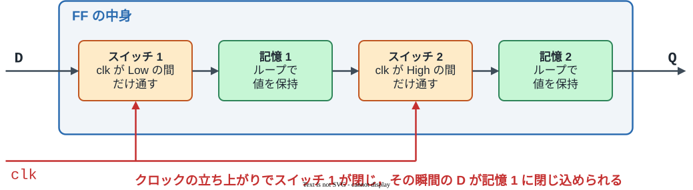

- **立ち上がりの前**: D の変化が記憶 1 のループに伝わりきるまでに、時間がかかる
  - 少し前から D を安定させておく必要がある。これが**セットアップ時間**
- **立ち上がりの後**: スイッチ 1 が閉じきるまでに、時間がかかる
  - 閉じきるまで D を変えてはいけない。これが**ホールド時間**
- 守れないと、ループが 0 と 1 の中間の状態で閉じ込められ、落ち着くまで時間がかかる
- このように、スイッチと記憶を 2 段つないだ FF を**マスタースレーブ型 FF** という

---

## セットアップ時間とホールド時間

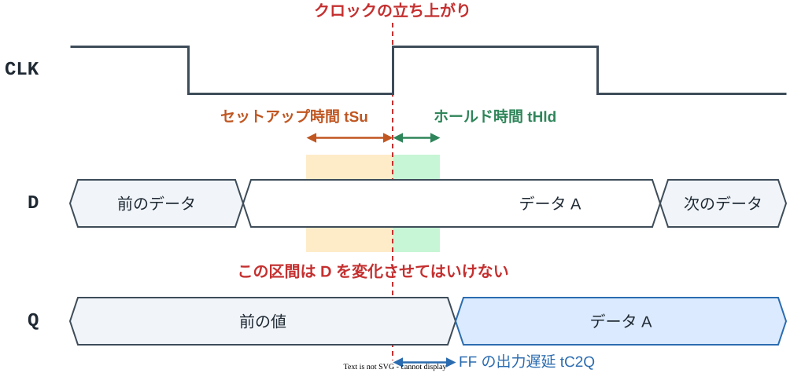

---

## FF のタイミングを表す 3 つの値

記号は Gowin EDA のレポートの表記に合わせる

| 記号 | 意味 | 他の書き方 |
|---|---|---|
| `tSu` | **セットアップ時間**: クロックの立ち上がりより前に、D を安定させておく時間 | tsu、tSU |
| `tHld` | **ホールド時間**: クロックの立ち上がりのあとも、D を変えてはいけない時間 | th、tH |
| `tC2Q` | クロックの立ち上がりから、Q が新しい値に変わるまでの時間 | tco、tCQ |

- `tSu` や `tHld` を守れないと、FF の出力がしばらく不安定になることがある。これを**メタステーブル**という

---

## FF から FF までの経路

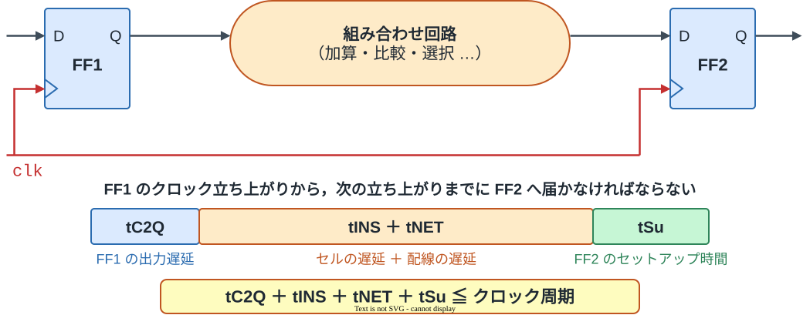

- `tINS`: LUT などのセルを通過する遅延。`tNET`: 配線を通過する遅延

---

<style scoped>section { font-size: 26px; }</style>

## スラック: タイミングの余裕

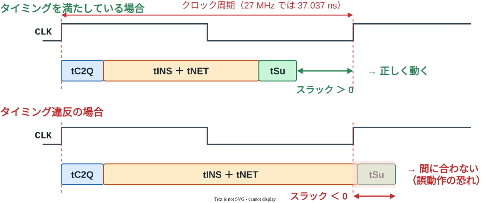

- **スラック** ＝ クロック周期 −（`tC2Q` ＋ `tINS` ＋ `tNET` ＋ `tSu`）
- レポートでは `Slack` ＝ `Data Required Time` − `Data Arrival Time` と表示される
  - データが届く期限から、実際に届く時刻を引いたもの

---

## 静的タイミング解析（STA）とは

- クロックの 1 周期の間に、データが組み合わせ回路を通過しきれなければならない
  - 1 クロックに詰め込める回路の量には限りがある
- **静的タイミング解析（STA）**: 回路を動かさずに、すべての経路の遅延を計算して、間に合うかを確かめる
- Gowin EDA は配置配線のあとに STA を行い、結果をレポートにまとめる
- ホールド時間 `tHld` も同じように確認される。今日はセットアップ側だけを見る

---
<style scoped>section { font-size: 22px; }</style>

## 遅延は温度と電圧で変わる

- 回路の遅延は一定ではない。電源電圧が低いほど、温度が高いほど、遅くなる
  - **電圧**: トランジスタは、電圧が高いほど大きな電流を流せる。電流が大きいほど、配線の容量を速く充放電できるので、信号が速く伝わる
  - **温度**: 温度が高いと、半導体の中を電子が動きにくくなり、電流が減る
- 同じ型番の FPGA でも、製造のばらつきで速い個体と遅い個体がある
- STA は、これらの条件がいちばん悪いときの遅延で確かめる

| レポートの項目 | 条件 | 確かめること |
|---|---|---|
| `Setup Delay Model: Slow 1.14V 85C` | 遅い個体、電圧の下限 1.14 V、最高温度 85 ℃ | 遅延が最大でも、セットアップ時間に間に合うか |
| `Hold Delay Model: Fast 1.26V 0C` | 速い個体、電圧の上限 1.26 V、最低温度 0 ℃ | 遅延が最小でも、ホールド時間を守れるか |

- 範囲はデータシートの動作条件。コア電圧は 1.2 V ± 5 %。型番の `C6/I5` は速度のグレードで、C は 85 ℃ まで、I は 100 ℃ まで

---
## 遅いときはセットアップ、速いときはホールドが厳しい

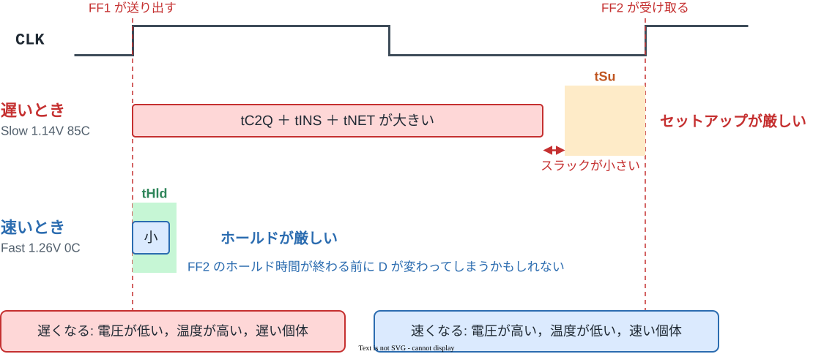

- STA は、遅い条件でセットアップを、速い条件でホールドを確かめる

---


## Gowin EDA でタイミングレポートを開く

- L チカのプロジェクトを開く。ビットストリームを生成したときに STA も実行されている

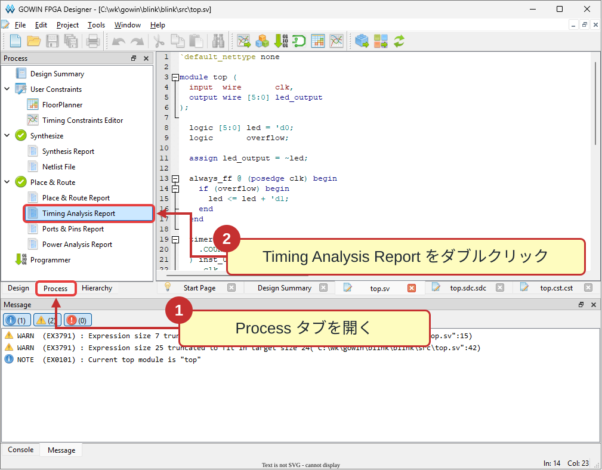

---

## L チカのタイミングレポートを見る (1): 最大周波数

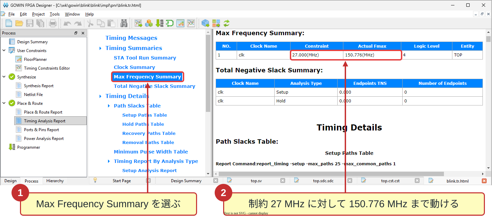

- **Max Frequency Summary**: この回路が動ける最大周波数が分かる
- `Constraint` が制約した周波数、`Actual Fmax` が実際に動ける最大の周波数
  - L チカは 27 MHz の制約に対して余裕で間に合っている

---

## L チカのタイミングレポートを見る (2): 経路とスラック

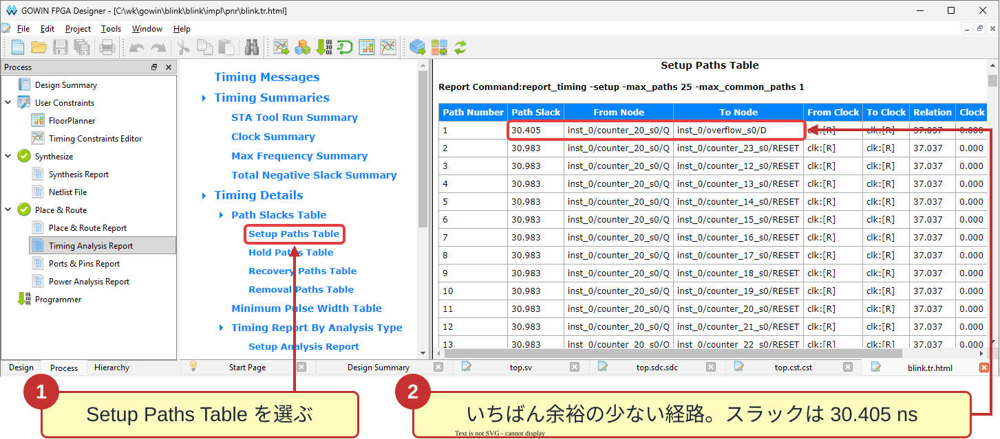

- **Setup Paths Table**: 余裕の少ない順に、経路とそのスラックが並ぶ
- いちばん上は `timer` の `counter` から `overflow` への経路
- 間に合わない回路を作るとどうなるかを、次の `sta_demo` で試す

<div style="font-size:60%;text-align:right">Gowin EDA V1.9.11.03 Education / GW1NR-LV9QN88PC6/I5（Device Version C）/ 遅延モデル Slow 1.14V 85C での実行結果</div>

---

<style scoped>section { font-size: 24px; }</style>

## 演習用デザイン: sta_demo

- プロジェクト: [`project/sta_demo/sta_demo.gprj`](https://github.com/Lathe-Mariel/DSF2026_FPGA_seminar/blob/main/project/sta_demo/sta_demo.gprj)
- `STAGES` 段の 32 ビット演算を **1 クロックの間に** 続けて行う

```sv
logic [31:0] cnt = '0;                         // 始点の FF（FF1）
always_ff @ (posedge clk) cnt <= cnt + 32'd1;

always_comb begin                              // 組み合わせ回路
  x[0] = cnt;
  for (int i = 0; i < STAGES; i++)
    x[i+1] = (x[i] + (x[i] << (i % 7 + 1))) ^ (cnt >> i);
end

always_ff @ (posedge clk) result <= x[STAGES]; // 終点の FF（FF2）
```

- 全体は「FF → 組み合わせ回路 → FF」の形。`for` で同じ形の回路を `STAGES` 個つなげている
- `STAGES` の初期値は 2。まずこのままビットストリームを生成して，レポートを開く

---

## レポート例: STAGES = 2（タイミングを満たす）

```text
<Tool Version>: V1.9.11.03 Education
<Numbers of Setup Violated Endpoints>:0

2.3 Max Frequency Summary
  NO.   Clock Name   Constraint    Actual Fmax   Level   Entity
  1     clk          27.000(MHz)   74.900(MHz)   8       TOP

3.1.1 Setup Paths Table（一部の列を省略）
  Path Number   Path Slack    From Node       To Node          Data Delay
  1             23.686       cnt_15_s0/Q   result_29_s0/D   12.951
```

- 制約 27 MHz に対して **74.9 MHz** まで動ける
- 最も厳しい経路でもスラックは **+23.686 ns** で，余裕がある

<div style="font-size:60%;text-align:right">Gowin EDA V1.9.11.03 Education / GW1NR-LV9QN88PC6/I5（Device Version C）/ 遅延モデル Slow 1.14V 85C での実行結果</div>

---

<style scoped>section { font-size: 25px; }</style>

## 経路の内訳を読む: STAGES = 2 の Path1

| レポートの項目 | 意味 | 値 |
|---|---|---:|
| `tC2Q` | 始点の FF cnt_15_s0 の出力遅延 | 0.458 ns |
| `tINS` の合計 | セルの遅延 | 5.590 ns |
| `tNET` の合計 | 配線の遅延 | 6.903 ns |
| `tSu` | 終点の FF result_29_s0 のセットアップ時間 | 0.400 ns |
| `Setup Relationship` | クロック周期 | 37.037 ns |

- スラック ＝ 37.037 −（0.458 ＋ 5.590 ＋ 6.903 ＋ 0.400）＝ **23.686 ns**
- レポートの表示は `Data Required Time` 38.969 − `Data Arrival Time` 15.283
  - どちらにも、クロックが FF に届くまでの遅延 2.332 ns が含まれている
- 遅延の半分以上は**配線**。FPGA では配線遅延も大きい

<div style="font-size:60%;text-align:right">Gowin EDA V1.9.11.03 Education / GW1NR-LV9QN88PC6/I5（Device Version C）/ 遅延モデル Slow 1.14V 85C での実行結果</div>

---

## 演習: 意図的にタイミング違反を起こしてみる

1. `src/top.sv` の `parameter int STAGES = 2` を **12** に変更する
2. ビットストリームをもう一度生成する
3. Timing Analysis Report を開いて、STAGES = 2 のときと比べる

- 注意: タイミング違反があっても**ビットストリームはエラーなしで生成される**
  - 書き込めば一応動くが、温度や個体差で誤動作するかもしれない回路になる
  - レポートを**自分で確認する**ことが大切

---

<style scoped>section { font-size: 20px; }</style>

## レポート例: STAGES = 12（タイミング違反）

```text
<Numbers of Setup Violated Endpoints>:6

2.3 Max Frequency Summary
  NO.   Clock Name   Constraint    Actual Fmax   Level   Entity
  1     clk          27.000(MHz)   19.769(MHz)   37      TOP

2.4 Total Negative Slack Summary
  Clock Name   Analysis Type   EndPoints TNS   Number of EndPoints
  clk          setup           -80.397         6

3.1.1 Setup Paths Table（一部の列を省略）
  Path Number   Path Slack    From Node      To Node          Data Delay
  1             -13.548      cnt_0_s0/Q    result_31_s0/D   50.185
```

- Actual Fmax が 27 MHz を下回る
- スラックが**マイナス** ＝ 1 クロックの間に計算が間に合わない

<div style="font-size:60%;text-align:right">Gowin EDA V1.9.11.03 Education / GW1NR-LV9QN88PC6/I5（Device Version C）/ 遅延モデル Slow 1.14V 85C での実行結果</div>

---

## STAGES = 12 のレポートの画面

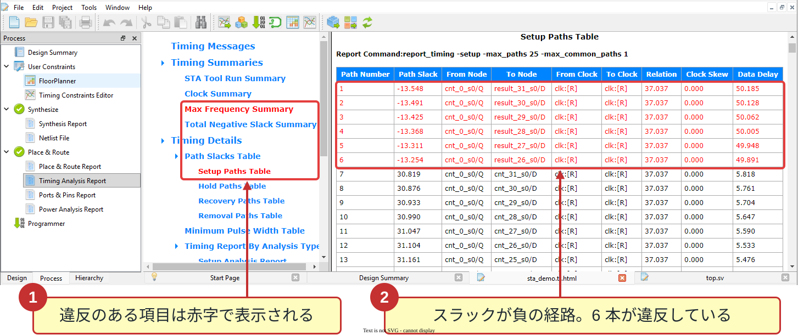

- 左の目次でも、違反のある **Max Frequency Summary** と **Setup Paths Table** が赤字になる

---

## 段数を変えるとどうなるか

| STAGES | 2 | 4 | 6 | 8 | 10 | 12 | 16 |
|---|---:|---:|---:|---:|---:|---:|---:|
| Actual Fmax (MHz) | 74.9 | 40.3 | 33.3 | 27.1 | 23.0 | 19.8 | 14.8 |
| ワーストスラック (ns) | 23.7 | 12.3 | 7.0 | 0.1 | −6.4 | −13.5 | −30.4 |

- 8 段で 27 MHz ぎりぎり、10 段以上で違反
- 違反したときの対策
  - クロック周波数を下げる
  - 演算の途中に FF を入れて、複数クロックに分ける。これを**パイプライン化**という

<div style="font-size:60%;text-align:right">Gowin EDA V1.9.11.03 Education / GW1NR-LV9QN88PC6/I5（Device Version C）/ 遅延モデル Slow 1.14V 85C での実行結果</div>

---

# 2-3. スイッチ入力

---

## ボタンで LED をシフトする回路

1. プロジェクト [`project/sw_button`](https://github.com/Lathe-Mariel/DSF2026_FPGA_seminar/tree/main/project/sw_button) を Gowin EDA で開く
2. ビットストリームを生成して書き込む
3. ボード上のボタン S2 を押す。押すたびに、点灯している LED が 1 つずつ移動する

- ボタンは **S2** を使う。FPGA の pin 3 につながっている

---

<style scoped>section { font-size: 24px; }</style>

## スイッチ入力で気をつけること

- スイッチは、クロックと関係のないタイミングで変化する。これを**非同期**の入力という
- そのまま回路で使うと、3 つの問題が起きる

| 問題 | 対策 |
|---|---|
| FF がメタステーブルになることがある | **2 段の FF で受ける**。同期化という |
| 押している間、ずっと 1 になる | **エッジ検出**で、押した状態に変化した直後だけを取り出す |
| 接点が細かく付いたり離れたりする。チャタリングという | ハードウェア: **ローパスフィルタ** <br/>ソフトウェア: **デバウンス回路** |

- クロックの違う回路どうしをつなぐときにも、同じ同期化が要る。**CDC**（Clock Domain Crossing）対策と呼ぶ

---

## コードを読む (1): 2 段の FF で受ける

```sv
wire left_shift = ~sw_in;           // ボタンは負論理なので反転する。押すと 1

logic [1:0] left_shift_reg = '0;    // 2 段の FF で受ける
always_ff @ (posedge clk) begin
  left_shift_reg[0] <= left_shift;
  left_shift_reg[1] <= left_shift_reg[0];
end
```

- 1 段目の FF は、`tSu` や `tHld` を守れずにメタステーブルになることがある
- 2 段目の FF で受け直して、不安定な値が回路全体に広がらないようにする
  - 後ろの回路は、2 段目の `left_shift_reg[1]` だけを使う

---

<style scoped>section { font-size: 24px; }</style>

## コードを読む (2): 押した状態に変化した直後に LED をシフトする

```sv
logic [1:0] left_shift_acc_reg = '0;   // 1 クロック前と今の値を覚える
always_ff @ (posedge clk) begin
  left_shift_acc_reg[0] <= left_shift_reg[1];
  left_shift_acc_reg[1] <= left_shift_acc_reg[0];
end
// 前が 0 で今が 1 ＝ 押した状態に変化した直後
wire left_shift_posedge = ~left_shift_acc_reg[1] & left_shift_acc_reg[0];

always_ff @ (posedge clk) begin
  if (left_shift_posedge) begin
    if (led[5]) led <= 'd1;            // 一番左まで行ったら最初に戻る
    else        led <= led << 1;       // 左に 1 つシフト
  end
end
```

- `left_shift_posedge` は、押した状態に変化した直後の 1 クロックだけ 1 になる
  - クロックに同期して検出するので、押した瞬間そのものではない。数クロック遅れる
- エッジ検出をしないと、押している間は毎クロック、1 秒に 2700 万回シフトしてしまう

---

## 演習

- LED が移動する向きを逆にする
  - ヒント: `<<` を `>>` に変える。端まで行ったときに戻る位置も変える
- 時間がある人: 押したときではなく、離したときに移動するようにする
  - ヒント: 「前が 1 で今が 0」を検出する
- 答えの例: [`project/sw_button/answer/top_reverse.sv`](https://github.com/Lathe-Mariel/DSF2026_FPGA_seminar/blob/main/project/sw_button/answer/top_reverse.sv)、[`project/sw_button/answer/top_release.sv`](https://github.com/Lathe-Mariel/DSF2026_FPGA_seminar/blob/main/project/sw_button/answer/top_release.sv)
  - `src/top.sv` を答えのファイルの内容に置き換えて、ビットストリームを生成する

---

## チャタリングとは

- スイッチを押したり離したりする瞬間に、接点が短い時間に何度も付いたり離れたりする現象
  - スイッチの機械的な構造によるもので、チャタリング自体をなくすことは困難
- さっきの回路に、対策のないスイッチをつなぐと、一度押しただけで LED が 2 つ以上移動することがある
  - エッジ検出が、チャタリングの 1 回 1 回を「押した」と数えてしまう
- 対策は 2 種類ある
  - **ハードウェア: ローパスフィルタ**。スイッチにコンデンサと抵抗を付けて、細かい変化を取り除く
  - **ソフトウェア: デバウンス回路**。FPGA の回路で、細かい変化を無視する

---

## チャタリングの実測波形

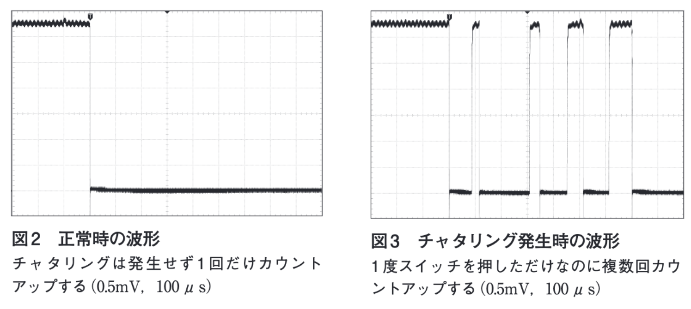

- 外付けのスイッチを押したときの電圧。右では、数百 µs の間に High と Low を 4 回行き来している

---

<style scoped>section { font-size: 21px; }</style>

## ソフトウェアの対策: デバウンス回路

- さっきの回路は 37 ns ごとにスイッチを見ているので、チャタリングに非常に敏感
- チャタリングが収まるくらいの間隔で見るようにすると、対策になる。プロジェクト: [`project/sw_fixed`](https://github.com/Lathe-Mariel/DSF2026_FPGA_seminar/tree/main/project/sw_fixed)
- 外付けのスイッチで試すとき: pin 86 と GND の間にタクトスイッチをつなぐ。対策なしは [`project/sw_ext_base`](https://github.com/Lathe-Mariel/DSF2026_FPGA_seminar/tree/main/project/sw_ext_base)、対策ありは [`project/sw_ext_fixed`](https://github.com/Lathe-Mariel/DSF2026_FPGA_seminar/tree/main/project/sw_ext_fixed)

```sv
localparam CLK_FREQ = 27_000_000;
localparam CAPTURE_FREQ_HZ = 100;
localparam COUNT_LIMIT = CLK_FREQ/CAPTURE_FREQ_HZ;
logic [$clog2(COUNT_LIMIT)-1:0] counter = 'd0;
wire sw_in_capture = (counter == COUNT_LIMIT - 1)? 1'b1: 1'b0;   // 10 ms に 1 回だけ 1 になる
always_ff @ (posedge clk) begin
  if (counter == COUNT_LIMIT - 1) counter <= 'd0;
  else                            counter <= counter + 'd1;
end

always_ff @ (posedge clk) begin
  if (sw_in_capture) begin          // 10 ms に 1 回だけスイッチを見る
    left_shift_acc_reg[0] <= left_shift_reg[1];
    left_shift_acc_reg[1] <= left_shift_acc_reg[0];
  end
end
```

---

## デバウンス回路（続き）: エッジ検出も同じタイミングで

```diff
   // 2段のフリップフロップの値からスイッチ入力の立ち上がりエッジを検出する
-  wire left_shift_posedge = ~left_shift_acc_reg[1] & left_shift_acc_reg[0];
+  wire left_shift_posedge = sw_in_capture & ~left_shift_acc_reg[1] & left_shift_acc_reg[0];
```

- `left_shift_acc_reg` は 10 ms に 1 回しか変わらない
  - そのままでは `left_shift_posedge` が 10 ms 間ずっと 1 になり、その間**毎クロック** LED がシフトしてしまう
- `sw_in_capture` との AND で、1 回の操作につき **1 クロックだけ** 1 にする
- 対策の効果は、3-1 のシミュレーションで確かめる

---

## ハードウェアの対策: ローパスフィルタ

- Tang Nano 9K のボタンには、10 kΩ の抵抗と 100 nF のコンデンサが付いている。これがローパスフィルタになる
  - 接点が一瞬離れても、電圧がゆっくりしか変化しないので、FPGA からは Low のままに見える
  - そのため、ボード上のボタンではチャタリングが起きなかった
- 対策のないスイッチをつなぐときは、デバウンス回路が要る

---

## ローパスフィルタの効果


---

# 2-4. ストップウォッチ

---

## ストップウォッチを動かす

1. プロジェクト [`project/stopwatch`](https://github.com/Lathe-Mariel/DSF2026_FPGA_seminar/tree/main/project/stopwatch) を Gowin EDA で開く
2. ビットストリームを生成して書き込む
3. 2-3 と同じボタン S2 を何回か押して、動作を確認する

| 操作 | 動作 |
|---|---|
| ボタンを押す | カウンタを 0 に戻して、計測を始める |
| もう一度押す | 計測を止める。LED に値が残る |

- 1 秒ごとにカウンタが 1 増える。LED 6 個にカウンタの値を 2 進数で表示する
- 63 秒まで計測できる

---

## 状態を持つ回路

- 同じボタンでも、押したときの動作が違う
  - 停止中に押すと、計測を始める
  - 計測中に押すと、計測を止める
- 回路が「今は停止中か、計測中か」を覚えているため。これを**状態**（ステート）という

| | 状態がない回路 | 状態がある回路 |
|---|---|---|
| 動作の決まり方 | 入力だけで決まる | **入力と状態で決まる** |
| 例 | スイッチで LED を点灯する回路 | ストップウォッチ |
| 同じ操作をすると | 常に同じ結果になる | 状態によって結果が変わる |

---

<style scoped>section { font-size: 26px; }</style>

## ステートマシン

- 状態を使って回路の動作を管理する仕組みを**ステートマシン**という
- **現在の状態**と**入力**から、**次の状態**が決まる
- ストップウォッチの状態は 2 つ。コードでは `IDLE` と `BUSY` という名前を付けている

```
        ボタンを押す          ボタンを押す
 IDLE ──────────────→ BUSY ──────────────→ IDLE
(停止中)            (計測中)             (停止中)
```

| 状態 | 動作 | ボタンを押すと |
|---|---|---|
| 停止中: `IDLE` | カウンタは止まっている | カウンタを 0 に戻して `BUSY` へ |
| 計測中: `BUSY` | 1 秒ごとにカウンタが 1 増える | カウンタを止めて `IDLE` へ |

---

<style scoped>section { font-size: 24px; }</style>

## コードを読む (1): ステートマシン本体

```sv
always_ff @ (posedge clk) begin
  case (state)
    IDLE: begin
      if (sw_posedge) begin
        count <= 'd0;      // カウンタを 0 に戻す
        state <= BUSY;     // 計測を始める
      end
    end
    BUSY: begin
      if (sw_posedge)    state <= IDLE;          // 計測を止める
      else if (sec_tick) count <= count + 'd1;   // 1 秒ごとに 1 増やす
    end
    default: state <= IDLE;
  endcase
end
```

- `enum` で定義した `IDLE` と `BUSY` を、`case` で分けている
- `sw_posedge` は 2-3 と同じエッジ検出の信号。`sec_tick` は 1 秒ごとに 1 クロックだけ 1 になる信号
- `default` で、想定外の状態になったときに `IDLE` へ戻す

---

## コードを読む (2): enum で状態に名前を付ける

```sv
typedef enum logic {
  IDLE,   // = 0
  BUSY    // = 1
} state_t;

state_t state = IDLE;
```

- `typedef enum` で、数値に名前を付ける。C の `enum` と同じ
- `state == IDLE` と書けるので、`state == 0` と書くより意図が伝わりやすい
- 状態は 2 つなので、1 ビットの `logic` で足りる

---

<style scoped>section { font-size: 23px; }</style>

## コードを読む (3): case で状態ごとに動作を分ける

```sv
case (state)
  IDLE:    ...  // state が IDLE のとき
  BUSY:    ...  // state が BUSY のとき
  default: ...  // どれにも当てはまらないとき
endcase
```

- C の `switch` 文に似ているが、作られるものが違う

| | C の `switch` | SystemVerilog の `case` |
|---|---|---|
| 作られるもの | 実行時に分岐する命令 | **マルチプレクサ**（選択回路） |
| 列挙漏れの影響 | 想定外の動作 | **意図しない記憶回路（ラッチ）ができることがある** |

- `default` は必ず書く
  - `always_comb` の中で列挙漏れがあると、列挙されていないときに値を保持する回路が作られる

---

<style scoped>section { font-size: 24px; }</style>

## コードを読む (4): 状態ごとの動作

```sv
IDLE: begin
  if (sw_posedge) begin
    count <= 'd0;
    state <= BUSY;
  end
end
```

- `IDLE` のとき: ボタンを押すと、カウンタを 0 に戻して `BUSY` へ移る
  - 押さなければ何も代入しないので、`state` も `count` も値を保持する

```sv
BUSY: begin
  if (sw_posedge)    state <= IDLE;
  else if (sec_tick) count <= count + 'd1;
end
```

- `BUSY` のとき: ボタンを押すと `IDLE` へ移る。押さなければ、1 秒ごとにカウンタを 1 増やす

---

## コードを読む (5): ここまでに出てきた回路

- ストップウォッチの残りの部分は、ここまでに出てきた回路の組み合わせ

| 回路 | 役割 | 出てきた場所 |
|---|---|---|
| 2 段の FF | ボタンの入力を同期化する | 2-3 |
| エッジ検出 | 押した状態に変化した直後を取り出す | 2-3 |
| デバウンス回路 | 10 ms ごとにボタンを見る | 2-3 |
| カウンタ | クロックを数えて 1 秒を作る | 2-1 の L チカ |

- 新しく出てきたのは `enum` と `case` だけ

---

## 2-4 のまとめ

- **ステートマシン**: 状態を使って回路の動作を管理する仕組み
  - `enum` で状態に名前を付ける
  - `always_ff` と `case` で、状態ごとの動作と次の状態を書く
- 同じ入力でも、状態によって違う動作をさせられる
- `case` には必ず `default` を書く

---

## 応用コラム: 状態のエンコーディング

- 状態にどんなビット列を割り当てるかを、エンコーディングという
- `enum` を使うと、合成ツールがエンコーディングを選ぶ

| 方式 | IDLE | BUSY | STOPPED | 特徴 |
|---|---|---|---|---|
| バイナリ | 00 | 01 | 10 | ビット数が少ない |
| ワンホット | 001 | 010 | 100 | 1 ビットだけが 1 になる |
| グレイコード | 00 | 01 | 11 | 隣の状態と 1 ビットしか違わない |

---

## 応用コラム: 1 ビットだけ変えたい理由

- バイナリで `BUSY` の `01` から `STOPPED` の `10` に移ると、2 ビットが同時に変わる必要がある
  - 実際の回路では完全に同時には変わらず、一瞬だけ `00` や `11` になることがある
- 同じクロックで動く回路の中では問題にならない
  - 次のクロックまでに値が落ち着くことを、STA で確かめているため
- 状態の値を、別のクロックで動く回路や外部にそのまま渡すときに問題になる
  - **グレイコード**は常に 1 ビットしか変わらないので、途中の値が出ない
- **ワンホット**は状態ごとに別のビットを使うので、状態の判定が速い

---

## 応用: STOPPED 状態を追加する

- 今のストップウォッチは、止めたあとにボタンを押すと、すぐにカウンタが 0 に戻る
- `STOPPED` という状態を追加すると、止めた値を確認してから 0 に戻せる

```
        ボタンを押す          ボタンを押す            ボタンを押す
 IDLE ──────────────→ BUSY ──────────────→ STOPPED ──────────────→ IDLE
(停止中)            (計測中)           (値を表示したまま)        (停止中)
```

---

<style scoped>section { font-size: 22px; }</style>

## 応用: コードの変更点

1. `enum` のビット幅を広げて、`STOPPED` を追加する

```sv
typedef enum logic [1:0] {  // logic を logic [1:0] に変える
  IDLE,
  BUSY,
  STOPPED                   // 追加
} state_t;
```

2. `BUSY` でボタンを押したときの移り先を、`STOPPED` に変える

```sv
    BUSY: begin
      if (sw_posedge) state <= STOPPED;  // IDLE を STOPPED に変える
```

3. `STOPPED` のときの動作を追加する

```sv
    STOPPED: begin
      if (sw_posedge) state <= IDLE;     // ボタンを押すと IDLE に戻る
    end
```

---

## 回路の動きを確かめる 2 つの方法

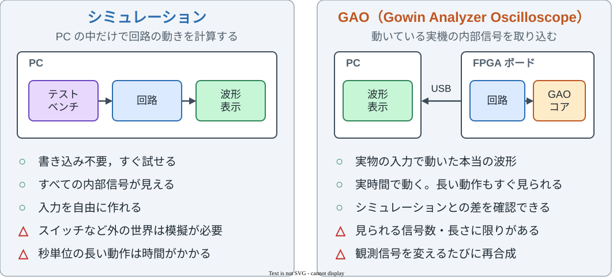

---

## 3-1 と 3-2 で見るもの

- 3-1 **シミュレーション**: 2-4 のストップウォッチを PC 上で動かし、コードどおりに動くことを確かめる
- 3-2 **GAO**: 動いている FPGA の中の信号を見る仕組みと、使い方を紹介する。題材は 2-4 のストップウォッチ

---

<!-- ============================ GAO ============================ -->

# 3-1. シミュレーションとテストベンチ

---


<!-- ============================ シミュレーション ============================ -->

<style scoped>section { font-size: 24px; }</style>

## シミュレーションの準備

- 使うツール。どちらも無償
  - **Icarus Verilog**: SystemVerilog のシミュレータ
  - **GTKWave**: 波形ビューア
- Windows 用の Icarus Verilog のインストーラ https://bleyer.org/icarus/ には GTKWave も含まれている
  - インストール時に「PATH に追加する」オプションを選ぶ
- 使うファイル: [`project/sim/`](https://github.com/Lathe-Mariel/DSF2026_FPGA_seminar/tree/main/project/sim/)

| ファイル | 内容 |
|---|---|
| `tb_top.sv` | テストベンチ |
| `run.bat` / `run.sh` | シミュレーション実行用。Windows は `run.bat`，Linux と Mac は `run.sh` |
| `wave.gtkw` | GTKWave の表示設定 |

---

## テストベンチとは

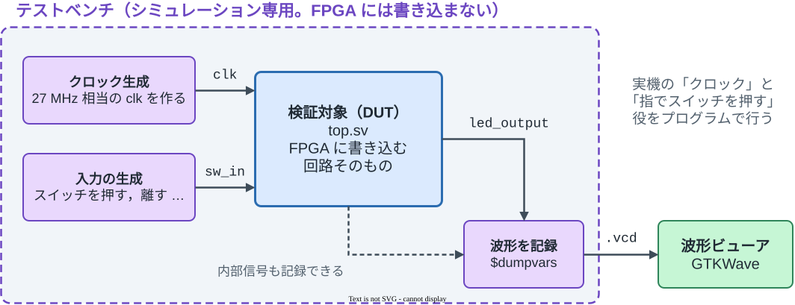

- 検証対象には 2-4 のストップウォッチの `top.sv` をそのまま使う
- テストベンチが、クロックと「指でボタンを押す」役をする

---

<style scoped>section { font-size: 22px; }</style>

## テストベンチの中身（抜粋）

```sv
always #18.518 clk = ~clk;            // 18.518ns ごとに反転して 27MHz のクロックを作る

top #(.CLK_FREQ(27_000)) dut (...);   // 1 秒を 27,000 クロックに縮めて、シミュレーションを短くする

task automatic push_button();         // ボタンを 50ms 相当押して離す
  sw_in = 1'b0; #(ONE_SEC / 20);
  sw_in = 1'b1; #(ONE_SEC / 20);
endtask

initial begin                         // 上から順に実行される手順
  push_button();                      // 計測開始
  `CHECK("ボタンを押すと計測中（BUSY）になる", dut.state == dut.BUSY)
  #(ONE_SEC * 3);                     // 3 秒待つ
  `CHECK("3 秒後にカウンタが 3 になる", dut.count == 3)
  push_button();                      // 計測停止
  `CHECK("もう一度押すと停止中（IDLE）になる", dut.state == dut.IDLE)
  ...
end
```

- `initial` や `#` はシミュレーション専用の書き方で，FPGA の回路にはならない
- `CHECK` は条件を調べて OK か NG を表示する。テストベンチの書き方の詳細は，このセミナーでは扱わない

---

## シミュレーションの流れ

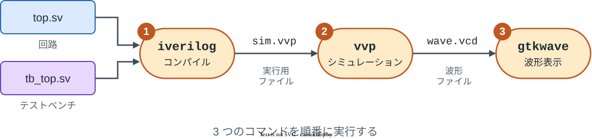

```
> cd project\sim
> run.bat                  （Linux と Mac では ./run.sh）
```

- `run.bat` が ① `iverilog` → ② `vvp` を順に実行する

---

<style scoped>section { font-size: 24px; }</style>

## 実行結果

```
 OK   最初は停止中（IDLE）で，カウンタは 0
 OK   ボタンを押すと計測中（BUSY）になる
 OK   カウンタは 0 から始まる
 OK   3 秒後にカウンタが 3 になる
 OK   LED は count を反転した値
 OK   もう一度押すと停止中（IDLE）になる
 OK   停止中はカウンタが変わらない
 OK   再び押すとカウンタが 0 に戻って計測中になる
 OK   63 秒後にカウンタが 63 になる
 OK   64 秒後にカウンタが 0 に戻る（6 ビットのあふれ）
------------------------------------------
 PASS: すべての確認に合格
------------------------------------------
```

- テストベンチが結果を**自動で判定**して PASS / FAIL を表示する
- 波形を見るには: `gtkwave wave.vcd wave.gtkw`

---

## 波形を見る

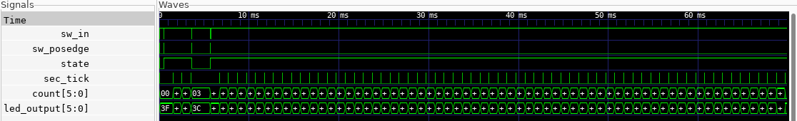

- 1 秒を 1 ms に縮めてある。1 ms ごとに `sec_tick` が出て `count` が 1 増え、`led_output` はその反転
- 1 回目のボタンで `state` が 1（BUSY）になり、2 回目で 0（IDLE）に戻る。停止中は `count` が変わらない
- 3 回目のボタンで `count` が 0 に戻り、64 秒後に `count` が 63 から 0 に戻る
  - 実機では 64 秒待つ必要があるが、シミュレーションでは 0.1 秒で確かめられる

---

## テストベンチの必要性

- 実機では**見えないもの**が見える
  - `state` や `sec_tick` などの内部の信号
- **同じ手順を何度でも**試せる
  - 「3 秒待って止める」を、毎回まったく同じタイミングで行える
- **結果を自動で判定できる**
  - コードを変更したら、もう一度実行して壊れていないか確かめる
- **時間を縮められる**
  - 1 秒を 27,000 クロックに縮めて、64 秒分の動作を 0.1 秒で試せる

---

## 演習: STOPPED 状態の答え合わせ

- 2-4 の応用「STOPPED 状態を追加する」を実装したら、テストベンチで確かめる
  - [`project/sim/tb_top_stopped.sv`](https://github.com/Lathe-Mariel/DSF2026_FPGA_seminar/blob/main/project/sim/tb_top_stopped.sv) は、ボタンを押すたびに IDLE → BUSY → STOPPED → IDLE と移ることを確かめる

```
> run_stopped.bat            （Linux と Mac では ./run_stopped.sh）
```

- `STOPPED` を追加する前に実行すると、FAIL になる
- 答えは [`project/sim/answer/top.sv`](https://github.com/Lathe-Mariel/DSF2026_FPGA_seminar/blob/main/project/sim/answer/top.sv)。`run_stopped.bat answer` で答えを検証できる
- LED を目で見て判断する代わりに、テストベンチが**自動で判定**する

---

# 3-2. GAO

---

## GAO の仕組み

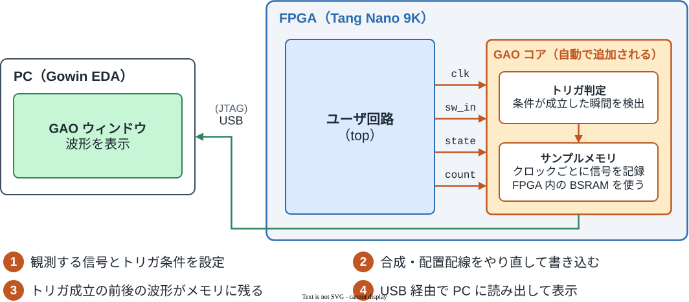

---

<style scoped>section { font-size: 21px; }</style>

## GAO 用のプロジェクト

- [`project/gao_stopwatch/gao_stopwatch.gprj`](https://github.com/Lathe-Mariel/DSF2026_FPGA_seminar/blob/main/project/gao_stopwatch/gao_stopwatch.gprj)
  - 2-4 のストップウォッチに、GAO の設定ファイル `src/stopwatch.rao` を追加したもの

| 設定 | 値 | 意味 |
|---|---|---|
| サンプルクロック | `clk` | 37 ns ごとに信号を記録する |
| 記録する信号 | `sw_in`、`sw_posedge`、`state`、`sec_tick`、`count[5:0]` | |
| トリガ | `sw_posedge` の立ち上がり、または `sec_tick` の立ち上がり | ボタンを押した直後か、1 秒ごとのカウントアップ |
| 記録の深さ | 1024 サンプル | 約 38 µs 分 |
| トリガ位置 | 16 | トリガの少し前から記録する |

- 制約ファイルには、JTAG のクロック TCK の定義と、`clk` とは非同期であるという指定を足してある
- 外付けスイッチのチャタリングを GAO で見る版: [`project/gao_sw_ext/gao_sw_ext.gprj`](https://github.com/Lathe-Mariel/DSF2026_FPGA_seminar/blob/main/project/gao_sw_ext/gao_sw_ext.gprj)。`sw_in` の立ち下がりをトリガにして、約 0.6 ms 分を記録する

---

## GAO を使うための準備: USB ドライバ

- GAO ウィンドウのケーブルの設定で、Tang Nano 9K が選べない、または接続できないことがある
- その場合は、**Zadig** で JTAG Debugger (Interface 0) のドライバを **WinUSB** に入れ替えると、つながることがある
  - 手順は、2-1 の補足「openFPGALoader でコンフィグレーションする (2)(3)」と同じ
  - GAO ウィンドウのケーブルは **Gowin USB Cable(WINUSB)** を選ぶ
- 今日は、ドライバの入れ替えと GAO の操作は行わず、手順を紹介する

---


## GAO の手順 1: 設定を確認する

1. Gowin EDA で `gao_stopwatch.gprj` を開く
2. Design タブの `stopwatch.rao` をダブルクリックして、GAO の設定画面を開く
3. 「GAO 用のプロジェクト」の表の設定になっていることを確認する

- 新しく作るときは、Design タブで右クリックして New File を選び、GAO Config File を作る

---

## GAO の手順 2: ビルドして書き込む

1. L チカと同じ手順でビットストリームを生成する
   - GAO コアが自動で追加される
2. Tools → **Gowin Analyzer Oscilloscope** で GAO ウィンドウを開く
3. GAO ウィンドウでケーブルに **Gowin USB Cable(WINUSB)** を選び、ビットストリームを書き込む

---

## GAO の手順 3: 状態の切り替わりを見る

1. ストップウォッチが停止中のときに、GAO ウィンドウの **Start** を押す。トリガ待ちになる
2. ボード上のボタン S2 を押す
3. トリガが成立すると、記録した波形が PC に読み出されて表示される

- `sw_posedge` が 1 クロックだけ 1 になり、次のクロックで `state` が `IDLE` の 0 から `BUSY` の 1 に変わる
- 同じクロックで `count` が 0 に戻る
- `sw_in` は、それより前から 0 になっている。デバウンス回路が 10 ms ごとにしかボタンを見ないため

---

## GAO の手順 4: カウントアップを見る

1. ストップウォッチが計測中のときに、もう一度 **Start** を押す
2. 1 秒以内に `sec_tick` でトリガが成立し、波形が表示される

- `sec_tick` が 1 クロックだけ 1 になり、次のクロックで `count` が 1 増える
- 2-4 で読んだステートマシンのコードのとおりに、実機が動いていることを確かめられる

---

## 3 のまとめ

- **シミュレーション**: PC 上で回路を動かして確かめる
  - テストベンチで入力を作り，結果を自動で判定できる
  - 内部の信号が見え，実機では用意しにくい入力も作れる
- **GAO**: 実機の FPGA の中の信号を取り込んで見る
  - 実物の入力で、回路が実際にどう動いたかを確かめられる
  - USB ドライバの設定が要る
- 両方を使い分けて，回路が正しく動くことを確かめる

---

## 本日のまとめ

- FPGA は，回路そのものを書き換えられる IC。LUT と FF と配線でできている
- SystemVerilog で回路を記述し，Gowin EDA でビットストリームにして書き込む
- 1 クロックに入れられる回路の量には限りがある。STA のレポートで確かめる
- 外からの非同期の入力は，2 段の FF で受けてから使う。スイッチにはチャタリング対策も要る
- 状態によって動作を変える回路は，ステートマシンで作る
- 正しく動くかは，シミュレーションと GAO で確かめる

---

---
<style scoped>section { font-size: 22px; } td:first-child { white-space: nowrap; }</style>

## ライセンスとクレジット

- この資料は **CC BY 4.0**（クリエイティブ・コモンズ 表示 4.0 国際）で公開している
  - https://creativecommons.org/licenses/by/4.0/deed.ja
- CQ出版の FPGA セミナー用に作成された教材（CC BY 4.0）をもとに，DSF2026 向けに構成と内容を改変したもの

| 著者 | 元の教材での担当 |
|---|---|
| 井田 健太 | FPGA の仕組み，Tang Nano 9K，静的タイミング解析，シミュレーション，GAO |
| 望月 英輔 | Gowin EDA の使い方と L チカ，スイッチ入力とデバウンス |
| 鈴木 量三朗 | always_comb の解説，ストップウォッチ |

- DSF2026 向けの改変と追加は井田 健太による
- 利用・改変するときは，著者名とリポジトリへのリンク，CC BY 4.0 であることを表示し，改変した場合はその旨を示す

---


<style scoped>section { font-size: 23px; }</style>

## もっと学ぶには: GOWIN FPGA 小冊子 vol.2

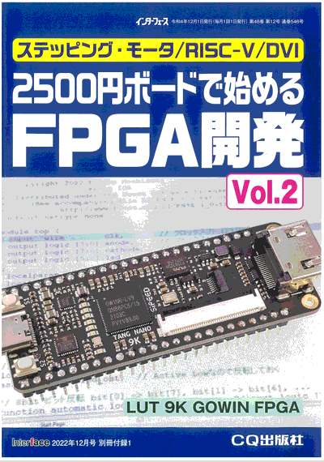

- Interface 2022 年 12 月号 別冊付録「**2500 円ボードで始める FPGA 開発**」（CQ出版社）
  - 今日と同じ **Tang Nano 9K** を題材にした小冊子
- 内容
  - 基礎編: ボードの紹介，開発環境の構築，L チカ，LED マトリクスの制御
  - 応用編: I2C の温度センサ，ステッピングモータ，DVI 出力，RISC-V ソフトコア
  - Python 編: 高位合成ツール Polyphony による HDL の生成
- 小冊子のページ: https://fpga.tokyo/vol2/
  - バックナンバーの PDF を購入できる
- 記事のサポートページ: https://interface.cqpub.co.jp/fpga02/
- Interface 2022 年 12 月号: https://interface.cqpub.co.jp/magazine/202212/
